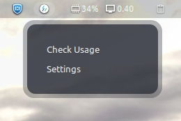
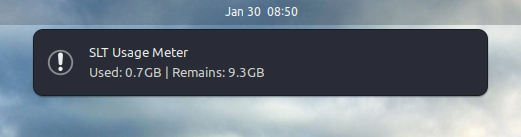

# Gnome Shell Extension : SLT Usage Meter 

## Screentshots 

## Requirements

- glib-compile-schemas
- gnome-extensions
- git
- vscode(prefers)

## Development

1. `git clone git@github.com:RavinduSachintha/slt-usage-meter_gnome-extension.git slt_usage_meter@ravindu.dhahas.com`

2. `sudo ln -s <Full path of project parent folder>/slt_usage_meter@ravindu.dhahas.com/ ~/.local/share/gnome-shell/extensions/slt_usage_meter@ravindu.dhahas.com`

3. `cd ./slt_usage_meter@ravindu.dhahas.com/`

4. `glib-compile-schemas schemas/`

5. Change the username and password in `constants.js` file as your SLT usage account credentials.

6. `gnome-extensions enable slt_usage_meter@ravindu.dhahas.com`

7. Restart gnome-shell
   - Use `Alt + F2` short-keys to get the "Run a commmand" window.
   - Type "r" and enter.

8. To disable the extension,
   - `gnome-extensions disable slt_usage_meter@ravindu.dhahas.com`

9. To check extension logs,
   - `journalctl -f -o cat /usr/bin/gnome-shell`